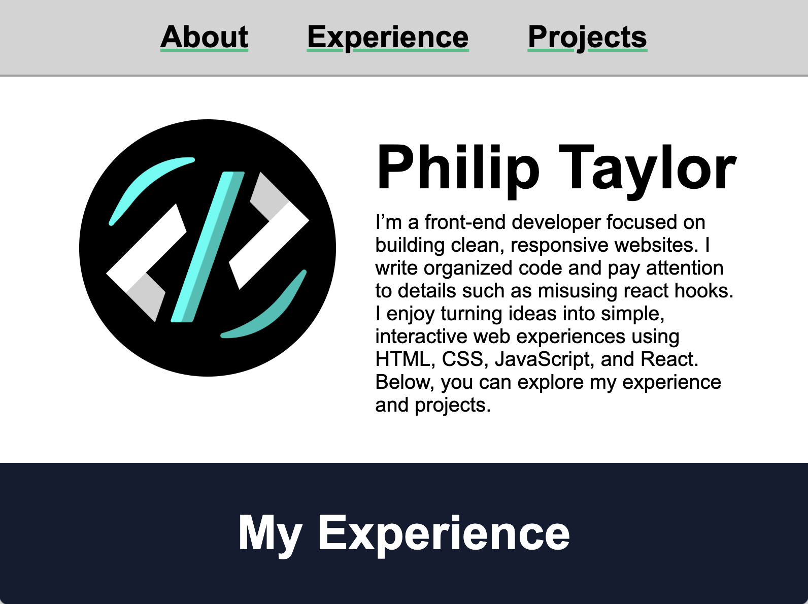
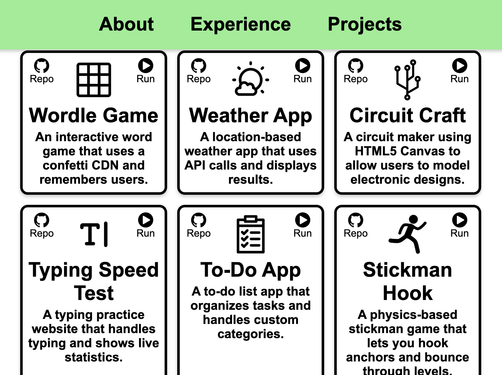

# Front-End Developer Portfolio

Built with React and Vite. HTML, CSS, and JavaScript are included.

## Quick View

[View Portfolio On Vercel](https://portfolio-olive-five-64.vercel.app)

## Features

- Responsive design
- Anchor links for smooth navigation
- Github repo and quick view links to my five other projects
- Screen reader accessibility

## Preview

 

## Getting Started

1. Clone the repo:
   ```bash
   git clone https://github.com/SilentViewer807/Portfolio.git
   ```
2. Navigate to the project directory:
   ```bash
   cd Portfolio
   ```
3. Install dependencies:
   ```bash
   npm install
   ```
4. Run the development server:
   ```bash
   npm run dev
   ```

## License

This project is open source and available under the MIT License.
